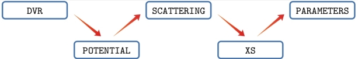

**BIGOS** – **B**inary **I**nelastic scattering and **G**eneralized **O**ptical cross **S**ection package is a set of FORTRAN 90 codes that
allow the user to obtain various physical quantities related to the scattering problem involving diatomic molecules and
atoms. The package is being developed at the Nicolaus Copernicus University in Toruń.



Here, we present the SCATTERING code, the central part of the BIGOS package.
The purpose of the SCATTERING code is to solve the coupled equations for a given scattering system, provide the
scattering S-matrix elements and calculate the state-to-state cross-sections.

**Please read the documentation generated with [FORD](https://github.com/Fortran-FOSS-Programmers/ford) in on the [GitHub pages site](https://hjozwiak-umk.github.io/bigos_h2he/doc/index.html).**

This version of the code is adjusted for diatom - atom collision systems,<br>
in particular the H<sub>2</sub> - He system. <br>
**Please, refer to this version of the code by citing the following paper** <br>
H. Jozwiak, F. Thibault, A. Viel, P. Wcislo, F. Lique, <br>
Rovibrational (de-)excitation of H<sub>2</sub> by He revisited <br>
https://doi.org/10.48550/arXiv.2311.09890


## Installation

### Prerequisites

* [Make](https://www.gnu.org/software/make/)
* A modern Fortran compiler, such as [GNU Fortran Compiler](https://gcc.gnu.org/wiki/GFortran) (gfortran) or
 [Intel Fortran Compiler](https://software.intel.com/content/www/us/en/develop/tools/oneapi/components/fortran-compiler.html) (ifort)
* [LAPACK](https://www.netlib.org/lapack/) and [BLAS](https://www.netlib.org/blas/) libraries
* [Git](https://git-scm.com/book/en/v2/Getting-Started-Installing-Git) (optional)

### Get the source code

#### Using git

```
git clone https://github.com/hjozwiak-umk/bigos_h2he.git ./bigos_dir
```

This will create a directory ``./bigos_dir`` on the local machine. Enter this directory.

#### Without git

Download the source code as a [zip file](https://github.com/hjozwiak-umk/bigos_h2he/archive/refs/heads/main.zip).<br>
Extract the contents to ``./bigos_dir`` and enter this directory.


### Building instructions

##### Linux systems

###### Before building the code, make sure that all the necessary tools and libraries are installed

```
sudo apt install make gfortran liblapack-dev libblas-dev git
```

* Enter the cloned directory
```
 cd bigos_dir
```
* Build the project using
```
make all
```


The script will extract the [wigxjpf](http://fy.chalmers.se/subatom/wigxjpf/) library in ``./libs`` directory, <br>
and then build and compile the contents of ``./src`` directory.  <br>
**The executable, ``scattering.x``, is located in the main directory.**

You can now run 
```
make test
```
to make sure that you recover reference outputs in the ``ref/`` directory.

##### Windows

Check out detailed building instructions for Windows [here](https://hjozwiak-umk.github.io/bigos_h2he/doc/page/installation/windows11.html).
